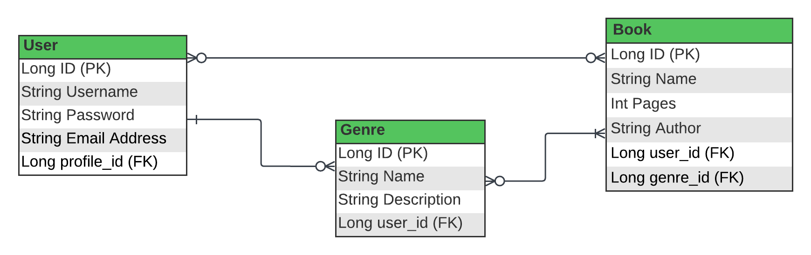

# Library App (Spring Mini Project)
Mini project from Interapt Immersive Bootcamp with Spring framework.

## Technologies Used:
IntelliJ \n
Spring Initalizer \n
Postman \n

## ERD 

## User Stories
As a new user, I want to be able to register for an account with my email and password so that I can access the library app.

As a registered user, I want to be able to log in with my email and password so that I can access my account and use the library services.

As a logged-in user, I want to see a list of categories (e.g., fiction, non-fiction, science fiction) in the library app so that I can browse books by category.

As a logged-in user, I want to be able to select a category from the list of categories so that I can view books within that category.

As a user who has selected a category, I want to see a list of books available in that category.

As a user interested in a particular book, I want to view detailed information about a specific book (e.g., title, author, description).
